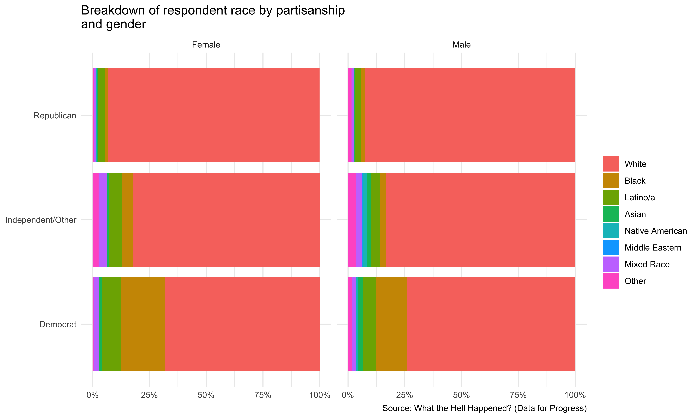

## Introduction

In the rapidly evolving political landscape of the United States, the
Republican Party faces a pivotal challenge: How can it effectively
balance the diverse views within its ranks while striving for electoral
success? This question lies at the heart of our analysis, commissioned
by the Republican Party itself. As political consultants, our task is to
dissect the party’s internal dynamics, understand its core strengths,
and identify potential fault lines that could impact its future
strategies.To achieve this, we will leverage the rich dataset from the
“What The Hell Happened?” project by Data for Progress (DFP). This
project offers a detailed glimpse into the opinions and attitudes of
party members, providing us with a comprehensive platform to analyze the
Republican Party’s current standing. Despite DFP’s left-leaning
inclination, their survey methodology is rigorous, making their data a
valuable asset for our analysis.Our focus will be twofold: First, we
will explore the issues that unite and divide the party. Then, we will
examine the party’s attitudes toward minority and underserved groups in
the US. This dual approach will enable us to offer nuanced advice on
which issues the party should prioritize and which to handle with more
sensitivity.With the backdrop of the party’s complex challenges
outlined, we now turn our attention to the robust dataset from the ‘What
The Hell Happened?’ project. This section will detail our methodological
approach, setting the stage for a nuanced understanding of the party’s
current standing and potential pathways forward.

## Data and Design

The dataset comprises 3,215 interviews from registered voters, weighted
to reflect the national voter demographics from 2018. The variables
include measures of political participation, policy positions, and
attitudes toward various demographic groups. We will measure partisan
membership using the party identification variable provided in the
dataset. The size of the Republican Party within the sample will be
assessed by counting the number of respondents who identify as
Republicans. The demographic profile of the party will be analyzed based
on race, education, and age distributions within the
Republican-identifying respondents. Armed with a comprehensive dataset
reflective of national voter demographics, our analysis will now delve
into the heart of the Republican Party. We begin by examining the
overarching characteristics of the party, followed by a deeper
exploration of the issues that unite and divide its members, and their
perspectives on diverse demographic groups.

## Analysis

### Overview of the Party

The visualizations below break down the demographic profile of the
Republican party by race, education, and gender. From the race and
gender graph, it appears that the majority of respondents who identify
as Republicans are White, regardless of gender. There is a smaller
representation of Black, Latino/a, Asian, Native American, Middle
Eastern, Mixed Race, and Other categories among the Republican
respondents.

As for education, the majority of Republican respondents across both
genders have some college education or have obtained a high school
diploma. There is a noticeable presence of those with a 2-year degree,
4-year degree, and postgraduate education as well, indicating a diverse
range of educational backgrounds within the party.

Fig. 1:Breakdown of Survey Respondents

Fig. 2:Breakdown of Survey Respondents

### Major Issues:

In the below visualizations , we use the survey responses to evaluate a
wide array of policy concerns , grouping responses by broader policy
categories. The first visualization depicts public opinion on two
immigration-related policy proposals. The first policy, “Deport
Undocumented Immigrants,” shows a significant portion of respondents
indicating ‘Strongly support,’ followed by a slightly smaller, yet
substantial, portion who ‘Strongly oppose’ the policy. The ‘Somewhat
support’ category is the next largest, while fewer respondents are in
the ‘Somewhat oppose’ and ‘Neither support nor oppose’ categories. The
second policy, “De-fund ICE” (Immigration and Customs Enforcement),
presents a contrasting distribution of opinions. The largest segment of
respondents ‘Strongly oppose’ the policy, followed by a smaller
proportion that ‘Strongly support’ it. The ‘Somewhat oppose’ category is
slightly larger than ‘Somewhat support.’ A minimal portion of
respondents indicate neutrality with ’Neither support nor
oppose.’Overall, the chart demonstrates a divided public opinion on
these immigration issues, with stronger feelings expressed either in
support of deporting undocumented immigrants or in opposition to
defunding ICE.

Fig. 3:Immigration Policies

The provided chart delineates the perspectives of Republican respondents
on gun control, segmented by age. It shows a spectrum of opinions
ranging from support for the current regulations to various degrees of
advocating for more or less stringent laws. The older demographic,
particularly those aged 65 and above, predominantly feel that the
current regulations are appropriate. In contrast, the youngest cohort,
aged 18-29, shows a notable inclination towards making it more difficult
to purchase all types of guns. The middle age groups (30-39, 40-49, and
50-64) display mixed views that span across making it more difficult to
buy some or all types of guns, to making it less difficult to buy some
types. The chart reveals an evident generational divide in the attitudes
towards gun control within the Republican respondents.

Fig. 4:Gun Regulations

The below visualization presents public support for two health
care-related policies: the production of life-saving drugs and Medicare.
The response categories include ‘Support’, ‘Strongly support’, ‘Strongly
oppose’, ‘Oppose’, and ‘Neither’ (neither support nor oppose).For the
production of life-saving drugs, there is a notable majority that either
supports or strongly supports the policy, with ‘Strongly support’ being
the most prevalent stance. There is a smaller but significant proportion
of respondents who ‘Strongly oppose’ or ‘Oppose’ the policy, and a very
small percentage are neutral.Regarding Medicare, the pattern of support
is similar, with the majority of respondents either supporting or
strongly supporting the policy. ‘Support’ appears to be the predominant
response, followed closely by ‘Strongly support’. Opposition to Medicare
is less than that for the production of life-saving drugs, and the
proportion of respondents who are neutral is similarly small.The
visualization underscores a strong backing for both health care-related
policies, with a greater consensus on the production of life-saving
drugs compared to Medicare.

The visualizations present data on the level of support for Donald Trump
among Republican age groups and their inclination to re-elect him. The
first chart, titled “Support for Trump Among Republicans by Age Group,”
shows varying degrees of support categorized as “strongly” and
“somewhat” for both Trump and the Republican Party, along with a “Not
sure” category, across five age groups: 18-29, 30-39, 40-49, 50-64, and
65+. The second chart, titled “Would Republicans Re-elect Trump?”,
depicts the percentage of Republicans in the same age groups who would
vote for Trump if given the chance. The vsualizations suggest that older
age groups tend to show stronger support for Trump and a higher
likelihood of re-electing him, compared to the younger demographics.

Fig. 6: Republicans on Supporting Donald Trump

Fig. 7:Trump Re-election

The below visualization displays public opinion on two policies:
pollution fees on high-emission companies and jobs in energy-efficient
infrastructure.The bar graph indicates that a significant majority
strongly supports both policies, with substantial support for pollution
fees and a slightly lesser, yet still majority, support for jobs in
energy-efficient infrastructure.

Fig. 8: Environmental and Economic Policies

The below visualization assesses the level of support for three
different policies related to marijuana: release for marijuana-related
offenses, reinvestment of marijuana tax revenues, and national
legalization of marijuana. The pattern of responses is similar across
all three policies, with a majority expressing strong support, a
moderate level showing somewhat support, and smaller fractions
indicating opposition.

Fig. 9: Marijuana

The below visualization “Republicans’ on Economic and Social Policies
Related to Wealth Distribution through Taxation,” illustrates the stance
of Republicans on four different economic and social policies. These
include a tax on wealth greater than USD 100 million, government
production of life-saving drugs, free college funded by tax on high
incomes, and a USD 5,000 savings account at birth. The graph suggests a
polarization of opinions with significant strong support and strong
opposition for the wealth tax and free college policies, while the
support appears more balanced for the production of life-saving drugs
and the savings account at birth initiative.

Fig. 10:Taxation of the Wealthiest

In the below visualization, “Republican Respondents’ Opinion on Various
Policies,” the opinions of Republican respondents on four policies are
showcased: ending US involvement in Yemen, ending solitary confinement,
drug test for government aid, and automatic voter registration. The
graph reveals a diversity of opinions, with notable strong support for
ending involvement in Yemen and strong opposition to automatic voter
registration, indicating a split in views on these policies among
Republicans.

Fig. 11:Other Policies

### Views on Underrepresented Groups

Having identified the core issues that garner agreements and differences
within the Republican party, our focus shifts to another critical
dimension: the party’s stance towards minority and underserved groups.
The visualization titled “Republican attitudes toward minority or
underserved groups in the US” depicts three histograms, each
corresponding to a different sentiment: Fear of Demographic Change,
Hostile Sexism, and Racial Animus. The histograms display the frequency
of responses on a scale from 0 to 1, where 0 likely indicates no fear or
hostility, and 1 indicates extreme fear or hostility. The Fear of
Demographic Change histogram shows a prominent peak around the 0.75
mark, suggesting a concentration of higher fear levels among
respondents. Hostile Sexism displays a more spread out distribution with
a notable peak just below 0.75, indicating a higher level of sexist
attitudes. The Racial Animus histogram also shows a spread but with
significant counts in the middle of the scale, suggesting relatively
lower levels of racial animosity among respondents. Collectively, these
histograms indicate that while there is a degree of unity in lower
levels of fear regarding demographic change, there is more division in
attitudes toward sexism and racial animus, with responses ranging widely
across the spectrum. As these scaled variables are aggregates of many
differnt questions regarding underserved groups in the survey, the
higher scaled values in two of the three variables indicates that the
views on underrepresented groups in the US among republicans is not too
positive.

Fig. 12: Attitude Towards Underserved Groups

## Conclusion

Through our analysis, it’s clear that the Republican Party stands at a
crossroads. The data-driven insights gleaned from the “What The Hell
Happened?” project have illuminated key aspects of the party’s internal
dynamics and public perception. Our findings suggest that while there
are issues of consensus that can serve as unifying forces, there are
also significant challenges in addressing the concerns and perspectives
of underrepresented groups.To navigate these complexities, we recommend
a balanced approach. The party should leverage its consensus on major
issues to strengthen its core base, while simultaneously engaging in
open dialogues and inclusive policies that resonate with minority and
undeserved communities. This dual strategy will not only reinforce the
party’s traditional strengths but also broaden its appeal to a more
diverse electorate, ensuring its relevance and vitality in the evolving
political landscape.The Republican Party’s path forward requires a
thoughtful blend of tradition and adaptation. By embracing both the
voices within and the changing demographics outside, the party can chart
a course towards sustained success and relevance in the American
political arena.

## Works Cited

<https://github.com/milesdwilliams15/Teaching/blob/main/DPR%20101/Notes/15_survey_data_pt2.md>
